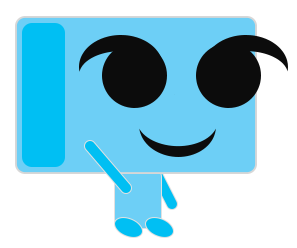
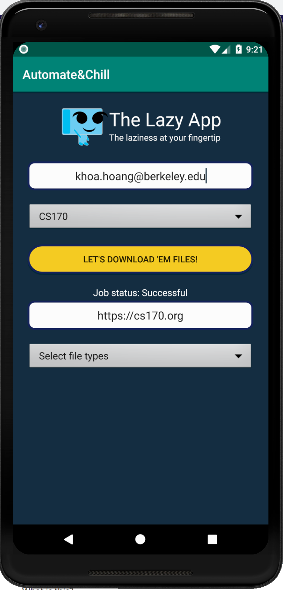
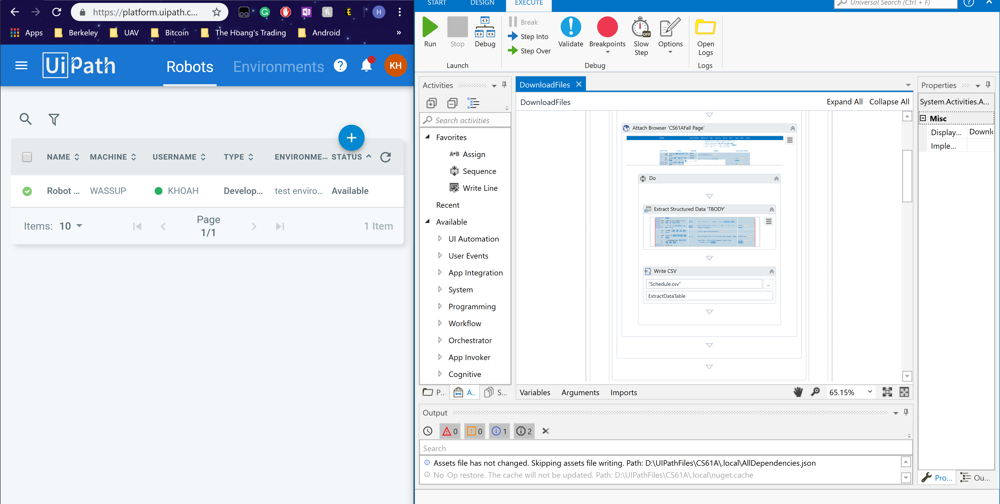

# Automate-Chill

[]
The Lazy App (as in Lazy Evaluation, just nerdy stuff).

We are Jessie Gross and Khoa Hoang from team Automate & Chill.

Our app eases the pain of downloading all the files from class websites as the semesters begin with just one click away.

The app utilizes UIPathStudio and, UIPathAPI to let the bots automate the tasks. The file will be zipped and sent to Google Drive and the share link will then be sent back to the user's email.

We are planning on expanding the app to fetch all the classes at Berkeley and letting people download the categorized essential files with just one click, sending notification everytime the websites are updated, update only new files and other features. We basically can integrate any things that require just one click away as the slogan of the app is "The laziness at your fingertip".

Story behind the app:

We stumbled upon UIPath's awesome software at the pre-hackathon event and fell in love with it so we decided to focus our ideation process on utilizing UIPath to create something useful and cool at the same time. The original idea was very simple, such as creating a workflow to automate some simple tasks to crazier ideas such as letting the bots repaint the Monalisa by pixelating the painting and using Photoshop's pencil to rebuild it. Finally, we came to a decision of building a more useful app starting from releazing the tediousness of downloading the files from class websites every time.

The idea went through a lot of challenges as almost everything was brand new to us. From getting used to the workflows in UIPath, working with and controlling the API, to the bigger improvements such as making the Android app, zipping files, uploading to Google Drive, sending out emails... Every single step was figured out with 2 mottos: "Keep calm and google", and "You're not alone." We bugged the whole UIPath team constantly and without them, this app would not be completed within 2 days.

We have always dreamt of building applications benefiting the community and if the oppotunity comes, we can make it bigger. That's why we're also building another app on both Android and IOS called Calbikes utilizing GoogleMap API to locate bike racks, pumps and shops as we realized we always had a hard time finding those as bikers.

Finally, we would like to give shoutouts to Eric, Evans and Joseph and others from UIPath for helping us the entire time through many difficult challenges and we also would like to thank Calhacks5.0 team for organizing such an amazing hackathon.

